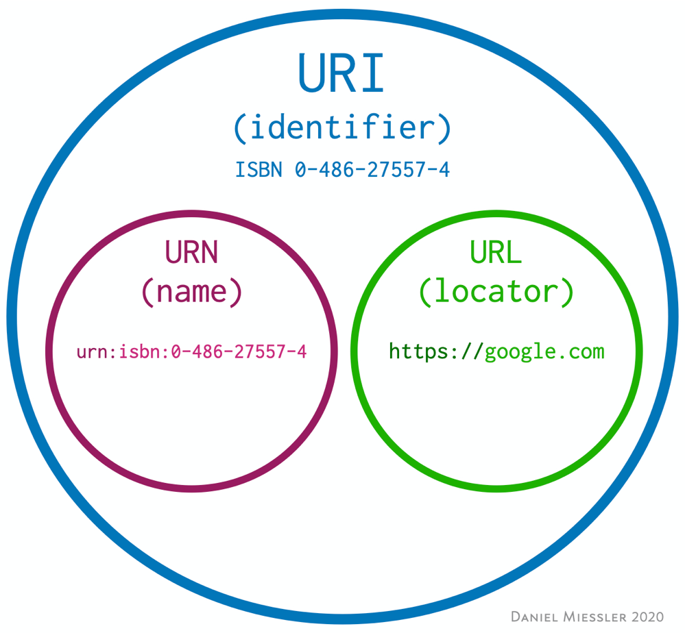
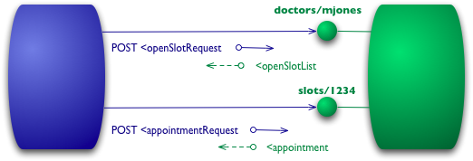

<style scoped>
section {
    color: white;
}
img {
    display: flex;
    float:right;
    margin-bottom: 100px;
}
</style>


Leonardo Lima
Bacharel Sistemas de Informação
Especialização em Desev. Web e Apps

Pesquisador tecnológico - CIAg


---

# Design de APIs

---

# O que é uma API?

--- 

# Application Programming Interface

É uma interface que define interações entre múltiplas aplicações de software. 
Ela define as chamadas ou requisições que podem ser feitas, como fazê-las, quais formatos de dados devem ser usados, etc.

---

# Formas de API

Existem APIs para várias finalidades, como linguagens de programação, bibliotecas de software, Sistemas Operacionais e comunicação com hardware.

---

# APIs web

São interfaces que definem como vão ocorrer interações entre uma aplicação e seus consumidores, utilizando como meio de comunicação a internet.

---

# REST

---


# REST -Representational State Transfer 

É um estilo arquitetural de desenvolvimento de software introduzido por Roy Fielding, em sua tese de doutorado em 2000.
Fielding estava envolvido na especificação 1.0 do HTTP, foi o principal autor da especificação 1.1 do HTTP e URI, e foi o co-fundador do projeto Apache Web Server.
REST é, antes de tudo, uma descrição da arquitetura da web. 

<!-- _footer: 'https://www.ics.uci.edu/~fielding/pubs/dissertation/top.htm
' -->

---

# REST

Desde 1994, o estilo arquitetural REST tem sido usado para guiar o design e desenvolvimento da web moderna. Este trabalho foi feito em conjunto com as minhas autorias dos padrões da internet para o Hypertext Transfer Protocol (HTTP) e Uniform Resource Identifiers (URI), as duas especificações que definem a interface genérica usada por todas as interações de components na web.

<!-- _footer: '*Roy Fielding, Architectural Styles and the Design of Network-based Software Architectures, p. 107.*' -->

---

# REST é definido por regras

--- 

# Arquitetura cliente-servidor

- Princípio da separação de responsabilidades
- Separar a UI dos dados aumenta a portabilidade entre plataformas
- Permite que os componentes evoluam separadamente

---

# Sem estado

* Nenhuma informação sobre sessão é armazenada no receptor (servidor)
* Toda requisição deve conter todas as informações necessárias para o servidor conseguir interpretá-la, e não pode utilizar nenhum contexto armazenado no servidor. 
* Dados sobre sessão são enviados pelo cliente, de forma que qualquer pacote de informação transferido pode ser interpretado de forma isolada, sem o contexto de outros pacotes enviados anteriormente.

---

# Cache

* As respostas do servidor devem incluir informações sobre cache, indicando ao cliente que requisições iguais e subsequentes podem reusar os dados obtidos anteriormente

---

# Sistema em camadas

* Um cliente não precisa saber se está conversando diretamente com o servidor, ou com algum componente intermediário. Se um proxy  ou load balancer for adicionado entre o cliente e o servidor, a comunicação entre estes não será afetada.
* Permite adicionar camadas de cache, segurança e outras, de forma isolada
* Um servidor também pode fazer requisições a outros servidores para responder a cliente

---

# Código sob-demanda (opcional)

* Permite que um servidor extenda ou personalize funcionalidades do cliente, por meio de código adicional baixado sob-demanda

---

# Interface uniforme

Parte fundamental do REST. Simplifica e desacopla a arquitetura. 

Por sua vez, é dividida em 4 regras

---

# Interface uniforme

## Identificação de recursos

---

# Interface uniforme: Identificação de recursos

* Recursos são a principal abstração do REST
* Podem ser descritos como um mapeamento conceitual a um conjunto de entidades concretas
* Cada recurso tem um identificador único, geralmente uma URI

---

# Interface uniforme: Identificação de recursos

URI - Identificador de um recurso específico, como livro, documento ou página


URL – um tipo especial de identificador que também diz como acessar um recurso, como por exemplo HTTP ou FTP. Exemplo: https://www.google.com

---




---

# Interface uniforme

## Manipulação de recursos através de sua representação

---

# Interface uniforme:Manipulação de recursos através de sua representação

* Recursos são conceitos abstratos e não podem ser manipulados diretamente pela rede
* Em vez disso, cliente e servidor trocam representações de recursos. Esses recursos podem ser representados de diferentes formas (JSON e XML, por exemplo)

---

# Interface uniforme:Manipulação de recursos através de sua representação

* A representação de um recurso ser igual ou não ao recurso original no servidor, é um detalhe que fica escondido por trás da interface

---

# Interface uniforme

## HATEOAS -Hipermídia Como O Motor de Estado da Aplicação

---

# Interface uniforme: HATEOAS

Ao acessar uma URI inicial de uma aplicação REST, o cliente deve conseguir descobrir todos os outros recursos que ele precisa, usando informações provides pelo servidor

---

# REST aplicado ao HTTP

---

# REST aplicado ao HTTP

APIs web que aderem ao REST, por meio do HTTP, geralmente serão compostas por:
* Um endereço base: https://servicodados.ibge.gov.br/api/
* O tipo de representação que ela aceita: JSON, XML, etc

---

# REST aplicado ao HTTP

<style scoped>
section {
    font-size: medium
}
</style>

| Método HTTP | Equivalente CRUD | Descrição |
| ----------- | ---------------- | --------- |
| GET | Ler (Read) | Lê a representação do estado atual de um recurso
| POST | Criar (Create) | Entrega para um recurso uma representação a ser processada
| PUT | Atualizar (Update) | Altera o estado de um recurso para o estado definido pela representação da requisição
| DELETE | Apagar (Delete) | Apaga o estado atual de um recurso

---

# REST

* De acordo com Fielding, quem não obedece todas as regras obrigatórias, não é REST
* REST vs RESTful “não existe”
    * Confusão gerada em idiomas não-ingleses
    * Sufixo que denota “estar cheio de”
    * Beauty – Beautiful
    * Fear – Fearful
    * Success – Successful
    * REST - RESTful

---

# Conectando conceitos

* NodeJS:
    * Windows: Instalador oficial (https://nodejs.org/en/download/)
    * Unix: NVM (https://github.com/nvm-sh/nvm)
* VS Code
    * https://code.visualstudio.com/
    * Extensão Thunder Client

---

# Iniciando o projeto Node

No seu diretório de trabalho, criar um subdiretório chamado `api-rest`
Usando o terminal/powershell, entrar no diretório `api-rest`
Inicializar um projeto com `npm init –y`
Adicionar dependências: 
* `npm i express`
* `npm i -D nodemon`

---

# Iniciando o projeto Node

No package.json, adicionar o script start:

```json
...
"scripts": {
    "start": "nodemon index.js",
    "test": "echo \"Error: no test specified\" && exit 1"
},
...
```

---

# Iniciando o projeto Node

Ainda no diretório `api-rest`, criar um arquivo chamado `index.js`

---

# Declarando a aplicação express

```js
const express = require('express');
const app = express();

app.listen(3000, () => console.log('Listening on port 3000'));
```

---

# Aplicando conceitos REST

---

# Aplicando conceitos REST

Temos um banco de dados com informações de uma oficina mecânica

Nesta oficina, os trabalhos são representados por ordens de serviços

Queremos criar uma API REST que vai expor esse banco de dados, para que um aplicativo também possa cadastrar e consultar informações do banco

---

# Declarando coleções e recursos

Vamos expor uma informação interna (ordens de serviço)

---

# Declarando coleções e recursos

Usar substativos em vez de verbos na URI

* `/orders` em vez de `/listOrders`

---

# Declarando coleções e recursos

Padrão de nomenclatura: singular ou plural?

* `/orders` ou `/order`?

---

# Consultar todas as ordens

```js
let orders = [
    {
        "id": 1,
        "description": "Manutenção do Golf",
    },
];

app.get('/orders', (req, res) => {
    res.send(orders);
});
```

---

# Definindo a representação

Hoje o mais utilizado é JSON

É interpretado nativamente pelo javascript no browser

É facilmente interpretado por humanos

Existem bibliotecas pra maioria das linguagens

---

# Definindo a representação

A não ser que você tenha requisitos muito específicos, escolha uma representação e mantenha-se nela

* Exceções se aplicam, como form data

---

# Definindo a representação

```js
app.use(express.json());
```

---

# Criar uma ordem

```js
app.post('/orders', (req, res) => {
    let newOrder = req.body;
    newOrder.id = orders.length + 1;
    orders.push(newOrder);
    res.status(201)
        .header('Location', '/orders/' + newOrder.id)
        .send(newOrder);
});
```

---

# Consultar uma ordem por id

```js
app.get('/orders/:id', (req, res) => {
    let order = orders.find(order => order.id == req.params.id);
    if (!order) {
        res.status(404).send();
        return;
    }
    res.send(orders);
});
```

---

# Utilizar códigos de resposta adequados

Códigos de resposta adequados ajudam os desenvolvedores e simplificam o código do cliente

---

# Utilizar códigos de resposta adequados

Se um código de erro puder confundir os consumidores, adicione informações extras no corpo da requisição

---

# Utilizar códigos de resposta adequados

404 (Not found) vs 410 (Gone)

---

# Manter a semântica dos verbos

PUT: cria um novo recurso ou substitui a representação do recurso pelo payload da requisição

<!-- _footer: 'https://developer.mozilla.org/en-US/docs/Web/HTTP/Methods/PUT
' -->

---

# Manter a semântica dos verbos

```js
app.put('/orders/:id', (req, res) => {
	???
});
```

---

# Manter a semântica dos verbos

```js
app.put('/orders/:id', (req, res) => {
    const order = orders.find(p => p.id == req.params.id);
    if (!order) {
        res.status(404).send();
    return;
    }
    order.description = req.body.description;
    res.status(200).send(order);
});
```

---

# Manter a semântica dos verbos

Deveria ser possível criar um registro fazendo um PUT em `/orders/:id`?

---

# Manter a semântica dos verbos

```js
app.put('/orders', (req, res) => {
	???
});
```

---

# Incrementando nosso modelo

Odens possuem serviços

Ordem -> um pra muitos -> serviços

---

# Incrementando nosso modelo

```js
let orderServices = [
    {
        "id": 1,
        "order_id": 1,
        "title": "Troca de pneu"
    },
    {
        "id": 2,
        "order_id": 1,
        "title": "Troca de calotas"
    },
];
```

---

# Incrementando nosso modelo

```js
app.get('/orders/:id/services', (req, res) => {
    const services = orderServices.filter(service => service.order_id == req.params.id);
    res.status(200).send(services);
});
```

---

# Evite aninhamento muito grande

Temos um endpoint para consultar serviços de uma ordem: 
`/orders/2/services`

Agora imagine que cada serviço deste pode ter insumos vinculados. A princípio, poderíamos criar um novo endpoint para consulta, da seguinte maneira:
`/orders/2/services/15/supplies`

---

# Evite aninhamento muito grande

Os aninhamentos podem acabar saindo do controle. Prefira criar novas collections.
Em vez de:
`/orders/2/services/15/supplies`

Ofereça
`/orders/2/services`
`/services/15/supplies`

---

# Evite aninhamento muito grande

Evite endpoints mais complexos que:

*`collection/item/collection`*

---

# Incrementando nosso modelo

```js
app.put('/orders/:id/services', (req, res) => {
	???
});
```

---

# Manter a semântica dos verbos

```js
app.put('/orders/:id/services', (req, res) => {
    let length = orderServices.length + 1;
    orderServices = orderServices.filter(service => service.order_id != req.params.id);
    let newServices = req.body;
    for (const service of newServices) {
        service.id = ++length;
    }
    orderServices.push(...newServices);
    res.status(200).send();
});
```

---

# Respeitar o aninhamento

```js
app.get('/orders/:id/services', (req, res) => {
    let services = orderServices.filter(service => service.order_id == req.params.id);
    res.status(200).send(services);
});
```

---

# Respeitar o aninhamento

```js
app.get('/orders/:id/services', (req, res) => {
    let order = orders.find(order => order.id == req.params.id);
    if (!order) {
        res.status(404).send();
        return;
    }

    let services = orderServices.filter(service => service.order_id == req.params.id);
    res.status(200).send(services);
});
```

---

# Removendo entidade

```js
app.delete('/orders/:id', (req, res) => {
    let order = orders.find(order => order.id == req.params.id);
    if (!order) {
        res.status(404).send();
        return;
    }
    orders = orders.filter(order => order.id != req.params.id);
    res.status(204).send();
});
```

---

# Respeitar a idempotência

É a propriedade que algumas operações têm de poderem ser aplicadas várias vezes sem que o valor do resultado se altere após a aplicação inicial

Um método HTTP é idempotente se uma requisição idêntica pode ser feita uma ou mais vezes em sequência, com o mesmo efeito, e o servidor permanece no mesmo estado.

---

# Idempotência != Seguro

Métodos seguros são aqueles que não modificam recursos

---

| Método HTTP | Idempotente | Seguro |
| ----------- | ----------- | ------ |
| OPTIONS | sim | sim |
| GET | sim | sim |
| HEAD | sim | sim |
| PUT | sim | não |
| POST | não | não |
| DELETE | sim | não | 
| PATCH | não | não |

---

# Respeitar a idempotência

Evite criar recursos com método GET

---

# Respeitar a idempotência

```js
app.delete('/orders/:id', (req, res) => {
    ...
        res.status(404).send();
    ...
    res.status(204).send();
});
```

---

# Respeitar a idempotência

Nosso exemplo de DELETE causa confusão em muitos desenvolvedores: hora o recurso retorna 204, hora retorna 404

Na verdade a idempotência é considerada do ponto de vista do servidor:
* Se a requisição for feita uma vez, eu espero que o recurso deixe de existir no servidor
* Se a requisição for feita duas vezes, eu ainda espero que o recurso não exista mais no servidor

---

# Algumas dicas

---

# Pense na paginação e ordenação

Adicionar paginação e ordenação explícita desde o começo pode evitar dores de cabeça futuras.

Entidades que se multiplicam muito durante o ciclo de vida de um software devem ser paginadas

Aumenta a performance e consequentemente melhora a experiência do usuário 

---

# Pense na paginação e ordenação

```js
let orders = Array.from({length: 1000}, (v,k) => {
    return {
        "id": k + 1,
        "title": "Hello " + k
    };
});
```

---

# Pense na paginação e ordenação

```js
app.get('/orders', (req, res) => {
    let page = parseInt(req.query.page, 10) || 1;
    let limit = parseInt(req.query.limit, 10) || 10;
    let startIndex = (page - 1) * limit;
    let slice = orders.sort((a,b) => a.id – b.id)
        .slice(startIndex, startIndex + limit);
    res.send(slice);
});
```

---

# Pense na paginação e ordenação

Onde incluir dados sobre a paginação?
* Cabeçalhos
* Transformar a resposta em um envelope, que contem os dados + metadados

---

# Pense na paginação e ordenação

Informação sobre paginação nos cabeçalhos:

```js
let total = orders.length;
res.set('Pagination-Count', total)
    .set('Pagination-Page', page)
    .set('Pagination-Limit', limit)
    .send(slice);
```

---

# Pense na paginação e ordenação

Informação sobre paginação no corpo da resposta:

```js
let response = {
    _metadata: {
        pagination: {
            page,
            limit,
            count,
        }
    },
    data: slice
};
```

---

# Pense na paginação e ordenação

Independente do formato escolhido, seja consistente

---

# *NÃO* faça isso

`GET /orders`, com múltiplos registros
```json
[
    {
      "id": 1,
      "title": "Hello"
    },
    {
      "id": 2,
      "title": "World"
    }
]
```

---

# *NÃO* faça isso

`GET /orders`, com 1 resultado
```json
{
      "id": 1,
      "title": "Hello"
}
```

---

# Pense nos filtros

Muitas das vezes, consumidores de uma API não precisam consumir o seu dataset completo

Adicionar capacidade de filtro e busca na sua API aumenta a flexibilidade para o consumidor e pode até melhorar a performance da sua aplicação

---

# Considere suporte ao método HEAD

O método HTTP HEAD solicita os cabeçalhos retornados de um recurso específico que foi requisitado por um método HTTP GET. 

Tal solicitação pode ser feita antes de baixar um grande recurso para economizar largura de banda, por exemplo.

Uma resposta para um método HEAD não deve ter um corpo. 

Se tiver, deve ser ignorado. Mesmo assim, entity headers (cabeçalhos de entidade) descrevendo o conteúdo do corpo (como Content-Length) podem ser incluidos na resposta. 

<!-- _footer: 'https://developer.mozilla.org/pt-BR/docs/Web/HTTP/Methods/HEAD' -->

---

# Recursos assíncronos

Algumas operações podem demorar, e bloquear o cliente na espera de uma resposta é uma experiência desagradável

O ideal é responder imediatamente, com um recurso onde o status da operação poderá ser consultado

---

# Recursos assíncronos

```js
let tasks = [];

app.post('/quotes', (req, res) => {
    let task = {
        id: tasks.length + 1,
        status: "InProgress"
    };
    tasks.push(task);

    setTimeout(() => {
        task.status = "Finished";
    }, 30000);

    res.status(202)
        .set('Location', '/quotes/status/' + task.id)
        .send();
});
```

---

# Recursos assíncronos

```js
app.get('/quotes/status/:id', (req, res) => {
    let task = tasks.find(t => t.id == req.params.id);
    if (!task) {
        res.status(404).send();
        return;
    }

    res.send({
        status: task.status,
    });
});
```

---

# Recursos assíncronos

HATEOAS para oferecer opção de cancelamento

```js
res.send({
    status: task.status,
    links: [
        {
            rel: 'cancel',
            method: 'delete',
            href: 'quotes/status/' + task.id
        }
    ]
});
```

---

```js
app.delete('/quotes/status/:id', (req, res) => {
    let task = tasks.find(t => t.id == req.params.id); 
    if (!task) {
        res.status(404).send();
        return; 
    }
    if (task.status == 'Finished') {
        res.status(406).send();
        return;
    }

    task.status = 'Cancelled';
    res.status(200).send();
});
```

---

# "Eager loading" vs "lazy loading"

Até o momento, estamos usando modelo REST "raiz"

`/orders` para consultar ordens, e `/orders/:id/services` para consultar os serviços de uma ordem

Mas e se a UI precisar exibir os serviços juntos das ordens?

---

```json
]
    {
        "id": 1,
        "description": "Manutenção do Golf",
        "services": [
            {
                "id": 1,
                "order_id": 1,
                "title": "Troca de pneu"
            },
            {
                "id": 2,
                "order_id": 1,
                "title": "Troca de calotas"
            }
        ]
    },
]
```

---

# "Eager loading" vs "lazy loading"

Oferecer dados relacionados pode facilitar o consumo da API

O carregamento de relacionamentos pode ser configurado através de parâmetros:

`GET /orders?fetchServices=true` vs `GET /orders?fetchServices=false`

Cuidados extras são necessários quando trabalhar com ORMs

---

# Aplique versionamento

APIs evoluem com o tempo. Novos campos são adicionados, outros substituídos, novas operações são adicionadas

Manter uma política de versionamento garante estabilidade aos consumidores da API

---

# Tipos de versionamento: URI

`https://supersite.com/api/v1/collection/item`

---

# Tipos de versionamento: URI

## Vantagens:

* Fácil para os humanos: basta olhar a URI e saber qual versão está sendo usada

## Desvantagens:

* Dependendo da maturidade da equipe, muita duplicação de código pode ser gerada

---

# Tipos de versionamento: Query param

`https://supersite.com/api/collection/item?version=1`

---

# Tipos de versionamento: Query param

## Vantagens:

* Fácil para os humanos: basta olhar o parâmetro e saber qual versão está sendo usada

## Desvantagens

* Query params são mais difíceis de rotear

---

# Tipos de versionamento: Cabeçalho
`Api-Version: 1`

---

# Tipos de versionamento: Cabeçalho

## Vantagens:

* A URI não fica poluída com versões de informação

## Desvantagens

* Requer manejo dos cabeçalhos


---

# Tipos de versionamento: negociação de conteúdo
`Accept: application/vnd.company+json; version=1`

---

# Tipos de versionamento: Cabeçalho

## Vantagens:

* Permite aplicar regras de versionamento para recursos específicos

## Desvantagens

* Requer manejo dos cabeçalhos

---

# Faça validação

Para APIs que permitem a entrada de informações, sempre valide a entrada

Mesmo que os campos sejam simples, mantenha alinhado com o armazenamento interno

---

# Implemente cache

Sempre que possível, implemente cache. Principalmente para dados que mudam com pouca frequência.

Mesmo que seu cliente não respeite a política de cache, um ator no meio pode implementar pra você

---

# Cabeçalhos de cache

```
Cache-Control: must-revalidate
Cache-Control: no-cache
Cache-Control: no-store
Cache-Control: no-transform
Cache-Control: public
Cache-Control: private
Cache-Control: proxy-revalidate
Cache-Control: max-age=<seconds>
Cache-Control: s-maxage=<seconds>
```

<!-- _footer: https://developer.mozilla.org/en-US/docs/Web/HTTP/Headers/Cache-Control -->

---

# Documente sua API

Uma documentação bem feita, e rica em informações e exemplos torna a integração com sua API mais suave

Demonstre respostas completas sempre que possível. 

Dê exemplos de entrada

Informe sobre validações

Existem diversas ferramentas que geram documentações inteiras a partir de formatos conhecidos (como o OpenAPI)

---

# Implemente testes na sua API

Testes automatizados garantem que alterações internas no seu código não irão violar a sua interface

---

# Implemente formato de erro padronizado

A RFC 7807 define um formato padronizado de erros para APIs HTTP:

<!-- _footer: ': https://tools.ietf.org/html/rfc7807' -->

---


```
 HTTP/1.1 400 Bad Request
Content-Type: application/problem+json
Content-Language: en

{
   "type": "https://example.net/validation-error",
   "title": "Your request parameters didn't validate.",
   "invalid-params": [ 
        {
            "name": "age",
            "reason": "must be a positive integer"
        },
        {
            "name": "color",
            "reason": "must be 'green', 'red' or 'blue'"
        }
    ]
}
```

<!-- _footer: 'https://tools.ietf.org/html/rfc7807' -->

---


# Modelo de maturidade

---

# Modelo de maturidade

Em 2008, Leonard Richardson sugeriu este modelo para classificar APIs web de acordo com seus níveis de aderência ao REST

---

# Modelo de maturidade


<!-- _footer: https://martinfowler.com/articles/richardsonMaturityModel.html -->

---

# Modelo de maturidade - Nível 0

O nível 0 é a ausência de padrões REST

O protocolo HTTP é usando simplesmente como um sistema de transporte  para interações remotas, sem usar macanismos da web

POX (plain old xml)

--- 

# Modelo de maturidade - Nível 0

Consultar os horários disponíveis de um médico

Requisição:

```
POST /appointmentService HTTP/1.1
[various other headers]

<openSlotRequest date = "2010-01-04" doctor = "mjones"/>
```

---

# Modelo de maturidade - Nível 0

Consultar os horários disponíveis de um médico

Resposta:

```
HTTP/1.1 200 OK 
[various headers]
<appointment>
	<slot doctor = "mjones" start = "1400" end = "1450"/> 
    <patient id = "jsmith"/>
</appointment>
```

---

# Modelo de maturidade - Nível 0

Criar uma consulta
Requisição:

```
POST /appointmentService HTTP/1.1 
[various other headers] 
<appointmentRequest> 
	<slot doctor = "mjones" start = "1400" end = "1450"/>
	<patient id = "jsmith"/>
</appointmentRequest>
```

---

# Modelo de maturidade - Nível 0

Criar uma consulta
Resposta de sucesso:

```
HTTP/1.1 200 OK
[various headers] 
<appointment> 
	<slot doctor = "mjones" start = "1400" end = "1450"/> 
	<patient id = "jsmith"/> 
</appointment>
```

---

# Modelo de maturidade - Nível 0

Criar uma consulta
Resposta de erro:

```
HTTP/1.1 200 OK
[various headers] 
<appointmentRequestFailure>
	<slot doctor = "mjones" start = "1400" end = "1450"/>
	<patient id = "jsmith"/> 
	<reason>Slot not available</reason>
</appointmentRequestFailure>
```

---

# Modelo de maturidade - Nível 0


---

# Modelo de maturidade - Nível 1

O nível 1 é a introdução de recursos

As requisições são separadas em diversos endpoints, ao invés de centralizadas em um único endpoint

---

# Modelo de maturidade - Nível 1

Consultar os horários disponíveis de um médico
Requisição:

```
POST /doctors/mjones HTTP/1.1 
[various other headers] 

<openSlotRequest date = "2010-01-04"/>
```

---

# Modelo de maturidade - Nível 1

Consultar os horários disponíveis de um médico
Resposta:

```
HTTP/1.1 200 OK
[various headers] 

<openSlotList> 
	<slot id = "1234" doctor = "mjones" start = "1400" end = "1450"/>
    <slot id = "5678" doctor = "mjones" start = "1600" end = "1650"/>
</openSlotList>
```

---

# Modelo de maturidade - Nível 1

Criar uma consulta
Requisição:

```
POST /slots/1234 HTTP/1.1 
[various other headers]

<appointmentRequest> 
	<patient id = "jsmith"/> 
</appointmentRequest>
```

---

# Modelo de maturidade - Nível 1

Criar uma consulta
Resposta:

```
HTTP/1.1 200 OK 
[various headers] 

<appointment> 
	<slot id = "1234" doctor = "mjones" start = "1400" end = "1450"/>
    <patient id = "jsmith"/> 
</appointment>
```

---

# Modelo de maturidade - Nível 1



---

# Modelo de maturidade - Nível 2

O nível 2 se caracteriza pela utilização de verbos e de códigos de resposta do HTTP

Até o nível 1, o HTTP estava sendo utilizado somente como um mecanismo de tunelamento

---

# Modelo de maturidade - Nível 2

Consultar os horários disponíveis de um médico
Requisição:

```
GET /doctors/mjones/slots?date=20100104&status=open HTTP/1.1 
Host: royalhope.nhs.uk
```

---

# Modelo de maturidade - Nível 2

Consultar os horários disponíveis de um médico
Resposta:

```
HTTP/1.1 200 OK
[various headers] 

<openSlotList> 
    <slot id = "1234" doctor = "mjones" start = "1400" end = "1450"/>
    <slot id = "5678" doctor = "mjones" start = "1600" end = "1650"/>
</openSlotList>
```

---

# Modelo de maturidade - Nível 2

Criar uma consulta
Requisição:

```
POST /slots/1234 HTTP/1.1 
[various other headers] 
<appointmentRequest> 
	<patient id = "jsmith"/> 
</appointmentRequest>
```

---

# Modelo de maturidade - Nível 2

Criar uma consulta
Resposta de sucesso:

```
HTTP/1.1 201 Created 
Location: slots/1234/appointment
[various headers] 

<appointment> 
    <slot id="1234" doctor="mjones" start="1400" end="1450"/>
    <patient id="jsmith"/> 
</appointment>
```

---

# Modelo de maturidade - Nível 2

Criar uma consulta
Resposta de erro:

```
HTTP/1.1 409 Conflict
 [various headers] 
<openSlotList> 
    <slot id = "5678" doctor = "mjones" start="1600" end = "1650"/>
</openSlotList>
```

---

# Modelo de maturidade - Nível 2


---

# Modelo de maturidade - Nível 3

O ultimo nível de maturidade se caracteriza pela adoção do HATEOAS

Cada resposta retornada pela API dá indicações de como o cliente pode proceder para outras ações

---

# Modelo de maturidade - Nível 3

Consultar os horários disponíveis de um médico
Requisição:

```
GET /doctors/mjones/slots?date=20100104&status=open HTTP/1.1 
Host: royalhope.nhs.uk
```

---

# Modelo de maturidade - Nível 3

Consultar os horários disponíveis de um médico
Resposta:

```
HTTP/1.1 200 OK
[various headers] 

<openSlotList>
    <slot id = "1234" doctor = "mjones" start = "1400" end = "1450">
        <link rel = "/linkrels/slot/book" uri = "/slots/1234"/> 	
	</slot>
	<slot id = "5678" doctor = "mjones" start = "1600" end = "1650">
        <link rel = "/linkrels/slot/book" uri = "/slots/5678"/>
    </slot>
 </openSlotList>
```

---

# Modelo de maturidade - Nível 3

Criar uma consulta
Requisição:

```
POST /slots/1234 HTTP/1.1 
[various other headers] 

<appointmentRequest> 
	<patient id = "jsmith"/> 
</appointmentRequest>
```

---

# Modelo de maturidade - Nível 3

Criar uma consulta
Resposta:

```
HTTP/1.1 201 Created 
Location: slots/1234/appointment
[various headers] 

<appointment> 
	<slot id = "1234" doctor = "mjones" start = "1400" end = "1450"/> 
	<patient id = "jsmith"/> 
	<link rel = "/linkrels/appointment/cancel" uri = "/slots/1234/appointment"/> 		
	<link rel = "/linkrels/appointment/addTest" uri = "/slots/1234/appointment/tests"/> 
	<link rel = "self" uri = "/slots/1234/appointment"/> 
	<link rel = "/linkrels/appointment/changeTime" uri = "/doctors/mjones/slots?date=20100104&status=open"/> 
	<link rel = "/linkrels/appointment/updateContactInfo" uri = "/patients/jsmith/contactInfo"/> 
	<link rel = "/linkrels/help" uri = "/help/appointment"/> 
</appointment>
```

---

# Modelo de maturidade - Nível 3


---

# Modelo de maturidade - Nível 3

Uma das grandes vantagens é a explorabilidade do protocolo da API

Ao analizar a resposta, o desenvolvedor consegue visualizar quais operações ele pode fazer em seguida

---

# Tarefa

Implementar uma API com nível de maturidade 3

Read-only é suficiente, write é um plus

Fonte de dados pronta (swapi.dev, fanzeyi/pokemon.json, https://servicodados.ibge.gov.br/api/docs, etc)

---

# Concluindo

De acordo com Fielding, sem HATEOAS não é REST

Na prática, a maioria das APIs só vão até o nível 2 de maturidade

And, for me, that’s ok

---

# Concluindo

Seguindo todos os pontos citados, com certeza vocês estarão prontos para criar APIs robustas, com uma boa manutenibilidade

Obrigado!